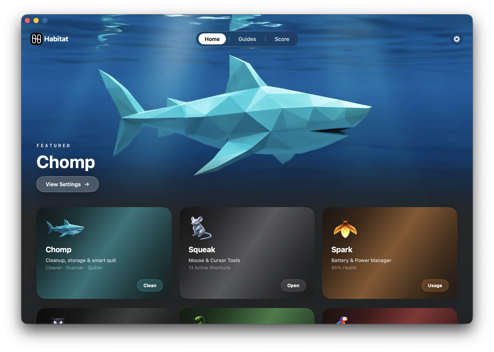
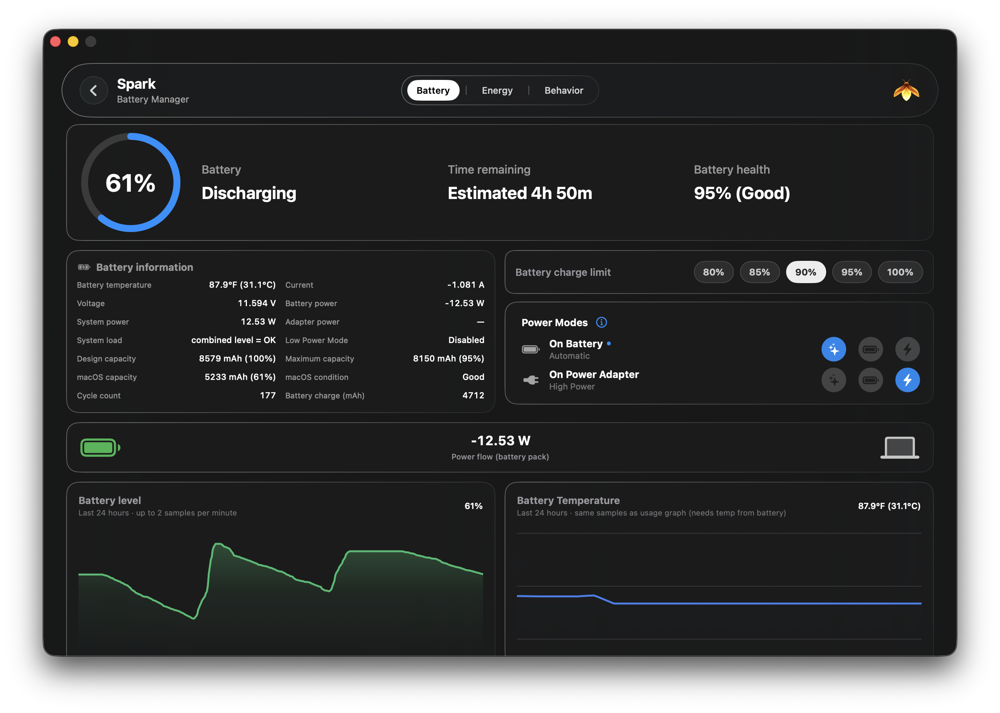
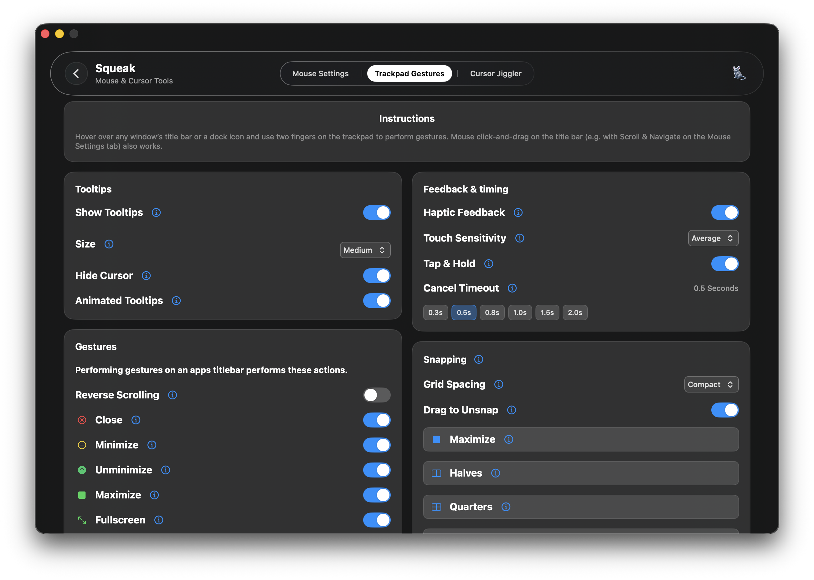
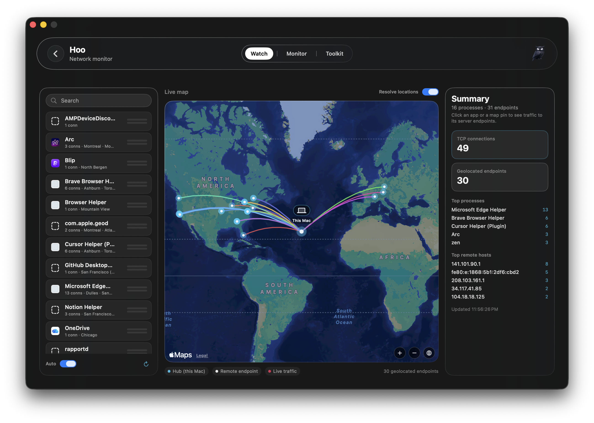
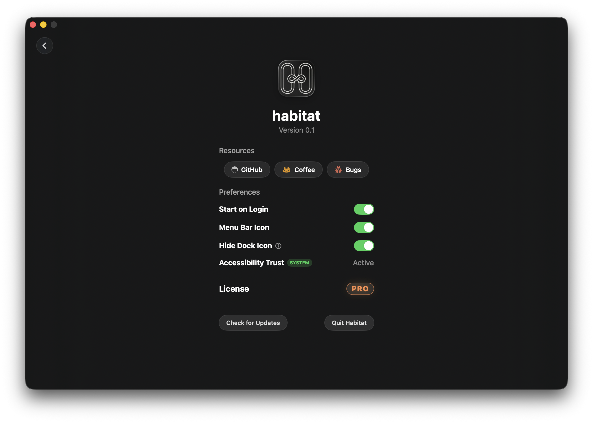

  
  &nbsp;&nbsp;&nbsp;&nbsp;
  
  &nbsp;&nbsp;&nbsp;&nbsp;
  
  &nbsp;&nbsp;&nbsp;&nbsp;
  

  <b>Habitat</b> 
  <i>The ecosystem your Mac's been missing.</i>

---

## About

**Habitat** is a native macOS utility suite that brings together the everyday tools you need to manage, optimize, and protect your Mac — all inside a single, beautifully designed app. No Electron. No subscriptions. Just a fast, lightweight SwiftUI app that lives in your Dock and menu bar.

## Screenshots

<table>
  <tr>
    <td align="center" valign="top" width="50%">
      <b>Home</b> 
      
    </td>
    <td align="center" valign="top" width="50%">
      <b>Chomp — Cleaner</b> 
      
    </td>
  </tr>
  <tr>
    <td align="center" valign="top">
      <b>Spark — Battery</b> 
      
    </td>
    <td align="center" valign="top">
      <b>Squeak — Trackpad gestures</b> 
      
    </td>
  </tr>
  <tr>
    <td align="center" valign="top">
      <b>Hoo — Watch (live map)</b> 
      
    </td>
    <td align="center" valign="top">
      <b>Boa — File compression</b> 
      
    </td>
  </tr>
  <tr>
    <td align="center" valign="top">
      <b>Echo — Clipboard history</b> 
      
    </td>
    <td align="center" valign="top">
      <b>Settings</b> 
      
    </td>
  </tr>
</table>

## Tools

Habitat is organized into nine purpose-built tools, each named after an animal or element that reflects its personality:

| Tool | Role | What It Does |
|------|------|--------------|
| **Chomp** 🦈 | Cleaner · Storage Map · Quitter | Disk cleanup, **Space Lens** storage visualization, and an intelligent app quitter that auto-terminates apps when their last window closes. |
| **Spark** ⚡ | Battery Manager | Real-time battery health dashboard, charge-history charts, power-adapter stats, per-app energy tracking, and a menu-bar battery indicator with configurable icons. |
| **Squeak** 🐭 | Mouse & Cursor Tools | Per-mouse profile settings, scroll speed & direction control, pointer acceleration curves, custom button mappings, and **mouse gestures** (Spaces & Mission Control, Scroll & Navigate). |
| **Hoo** 🦉 | Network Security | Live outgoing-connection monitor with IP geolocation mapping, per-app bandwidth, DNS resolver tools, and a world-map view of where your Mac is talking to. |
| **Boa** 🐍 | Compress & Encrypt | File compression (ZIP / TAR) and secure file encryption to protect sensitive data. |
| **Echo** 🦜 | Clipboard Manager | Persistent clipboard history with search, pinning, per-app exclusions, and one-click paste — never lose a copied snippet again. |
| **Shadow** 🌙 | Notch Tools & Screen Breaks | Hover/click shelf around the Mac notch (Now Playing, quick actions, camera mirror, file shelf) — plus **Biscuits** full-screen rest breaks on a timer, with menu-bar integration. |
| **Burrow** 🦡 | Folder Quick Look | Displays a sortable, detailed folder table and archive preview directly inside Finder's own Quick Look panel when you press Space. |
| **Leap** 🐸 | Window Switcher & Navigator | Fast Command-Tab-style window switcher with thumbnail, app-icon, and title layouts, keyboard and mouse navigation, and light / dark / system themes. |

## Menu Bar

Habitat integrates with the macOS menu bar without getting in the way:

- 🌿 **Habitat main icon** — Click for a native-feeling dropdown with a **dashboard shortcut**, per-tool quick opens, About, and Check for Updates. The dropdown uses a transparent divot-arrow panel that matches the rest of macOS HUDs.
- 🔋 **Spark battery** — Optional live charge / time-remaining indicator with customizable glyph styles.
- 📋 **Echo clipboard** — Optional quick-access popover for your clipboard history with hover previews that fly in and out smoothly as you move between items.

## Pro & Trial

- 🆓 **14-day full trial** — Every Pro tool is unlocked during the trial. Trial time is counted as **active runtime**, not wall-clock: if you close Habitat for a week, the trial doesn't tick down.
- 🆓 **Chomp is always free** — Cleanup, Space Lens, and the window-aware quitter work forever without a license.
- 💳 **$6.99 one-time** — Lifetime access, no subscriptions. Trial expiry never deletes your data; Chomp keeps working, and the other tools can be reactivated any time by entering a key.
- 🔁 **Self-service deactivation** — Free up a license seat from **Settings → License → PRO** so you can move Habitat to another Mac.

## Privacy

- 🔒 **100% local processing** — Clipboard history, connections, battery telemetry, disk scans — nothing leaves your Mac.
- 🚫 **No accounts, no telemetry, no cloud sync**.

## Features

- 🎨 **Beautiful native UI** — Frosted glass panels, smooth animations, and a design built entirely with SwiftUI.
- 🚀 **Lightweight** — A single native process with minimal CPU and memory footprint.
- 🖥️ **Persistent** — Habitat stays running in the background when you close its window, just like Finder. Reopen from the Dock icon to surface the main window again.
- 📥 **Auto-updates** — Powered by [Sparkle](https://sparkle-project.org) with an in-app **Check for Updates** in both Settings and the Habitat app-menu.

## Requirements

- **macOS 26.0 (Tahoe)** or later
- **Apple Silicon** (arm64)
- **Accessibility permission** — required for Squeak's mouse controls, trackpad title-bar gestures, window management, and Chomp's window-aware quitter.

## Installation

1. Download the latest release from the [Releases](../../releases) page.
2. Open the `.dmg` and drag **Habitat** to your Applications folder.
3. On first launch, macOS will prompt for access in **System Settings → Privacy & Security → Accessibility** (and optionally **Input Monitoring** / **Automation** depending on which tools you enable).

Habitat ships with [Sparkle](https://sparkle-project.org) for automatic updates — you can also trigger a check manually from **Habitat → Check for Updates** (menu bar) or **Settings → Check for Updates** (in-app).

## Support

If you enjoy Habitat and want to support its development:

  

## Feedback & Bugs

Found a bug or have a feature request? Open an [Issue](../../issues) or use the **Report Bug** button inside **Habitat → Settings**.

---

## License

Habitat is proprietary software. All rights reserved.
See [LICENSE](LICENSE) for details.

---

  Made with ❤️ for macOS

